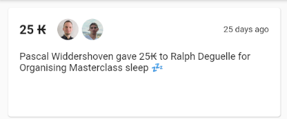
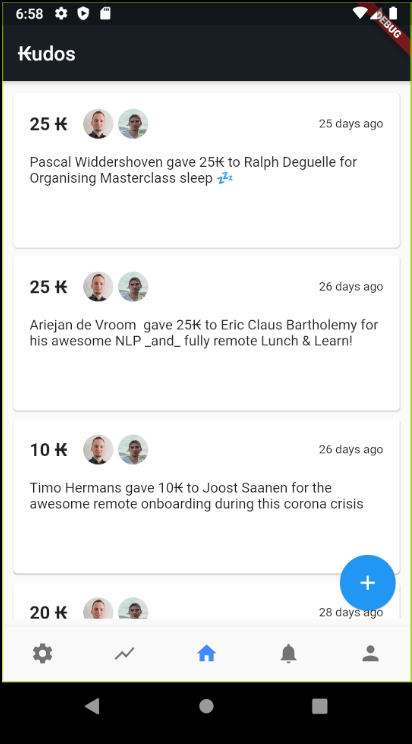
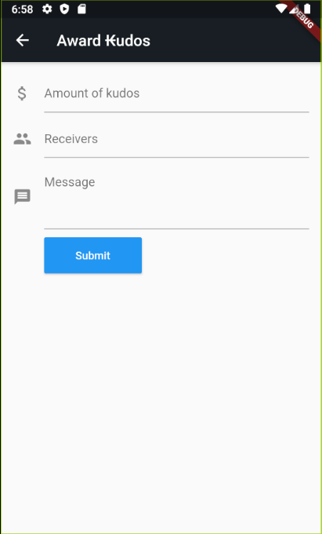
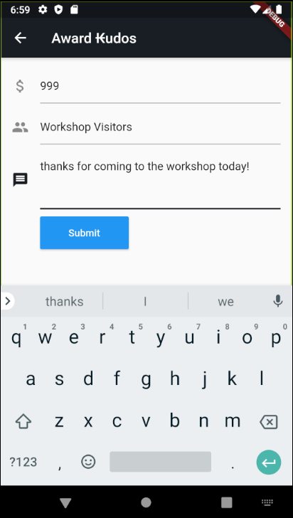

# Flutter Workshop

In this repo you'll find a [starter project](./) and the [full finished app](../final_app).
For this workshop we'll start out with the starter app, but feel free to take a peek at the final app too.

To get going clone this repo and open the `workshop_starter` project in your editor of choice.
```
$ git clone https://github.com/kabisa/appdevcon-2022.git
$ cd appdevcon-2022/workshop_starter
```

## Exercise 1: Kudo Card

The first User Story on our backlog is the following:

> As a user, I want to see a Kudo transaction, so that I display Kudos given and received

The designer sent you a mockup:



---

Together with the team, you discussed, that you'll need the following Flutter widgets:

* [Card](https://api.flutter.dev/flutter/material/Card-class.html)
* [Circle Avatar](https://api.flutter.dev/flutter/material/CircleAvatar-class.html),
  [NetworkImage](https://api.flutter.dev/flutter/painting/NetworkImage-class.html)
* [Text](https://api.flutter.dev/flutter/widgets/Text-class.html)
* [Container](https://api.flutter.dev/flutter/widgets/Container-class.html),
  [Row](https://api.flutter.dev/flutter/widgets/Row-class.html),
  [Column](https://api.flutter.dev/flutter/widgets/Column-class.html),
  [Padding](https://api.flutter.dev/flutter/widgets/Padding-class.html),

You can implement the Kudo transaction card widget in [./lib/widgets/transaction_widget.dart](./lib/widgets/transaction_widget.dart).

<details>
  <summary>Solution</summary>

  * [Transaction Widget](../final_app/lib/widgets/transaction_widget.dart)
</details>

---

# Exercise 2: Kudo Feed

Next on the backlog is the following story:

> As a user, I want to see a Kudo transaction feed, so that I see a list of Kudos given.

The whole thing should look like this:



To ship this feature, you will only need this Flutter widget:

* [ListView](https://api.flutter.dev/flutter/widgets/ListView-class.html)

The [Transactions](./lib/data/transactions.dart) class contains some mock data you can use:

```dart
Transactions.dummyTransactions
```

You can start implementing the ListView in [lib/screens/home_screen.dart](./lib/screens/home_screen.dart).
When done, move the list view into a separate widget, `TransactionsList`.

<details>
  <summary>Solution</summary>

  * [Transaction List](../final_app/lib/widgets/transaction_list.dart)
</details>

<details>
  <summary>If you're feeling adventurous</summary>

  You can also implement a Grid to Transactions in a grid (nice for desktop!).
  Use the Flutter [GridView](https://api.flutter.dev/flutter/widgets/GridView-class.html).

  [Transaction Grid in final app](../final_app/lib/widgets/transaction_grid.dart)
</details>

## Exercise 3: Kudo Form

Great, we can nicely display Kudo transactions!

Now let's make sure we can send Kudos as well:

> As a user I want to send Kudo's to someone, to let them know my appreciation

The mockups show what we need to build:




Based on the mockup we will need the following Flutter widgets:

* [Form](https://api.flutter.dev/flutter/widgets/Form-class.html)
* [FormValidators](https://api.flutter.dev/flutter/widgets/FormFieldValidator.html)
* [TextFormField](https://api.flutter.dev/flutter/material/TextFormField-class.html)
* [TextInputFormatter](https://api.flutter.dev/flutter/services/TextInputFormatter-class.html)
* [InputDecoraction](https://api.flutter.dev/flutter/material/InputDecoration-class.html)

You can start implementing the Kudo Form in [lib/screens/new_transaction_screen.dart](./lib/screens/new_transaction_screen.dart).

<div style="background-color: #e7f8ff; color: #000; padding: 1em; margin-bottom: 1em;">ℹ️ <strong>Note:</strong> You don't have to implement _storing_ the new Transaction yet. If the form can be validated and submitting the form closes the page, you're done!</div>

<details>
  <summary>Solution</summary>

  * [New Transaction Screen](../final_app/lib/screens/new_transaction_screen.dart)
</details>

# Exercise 4: Storing new transactions (in memory) and displaying them

* [Scaffold](https://api.flutter.dev/flutter/material/Scaffold-class.html) To display a snackbar or a persistent bottom sheet
* [Scaffold.of(context)](https://api.flutter.dev/flutter/material/Scaffold/of.html) to talk with the snackbar
* [Provider](https://pub.dev/packages/provider) Package for Provider and Consumer of Transactions
* [ChangeNotifier](https://pub.dev/documentation/provider/latest/provider/ChangeNotifierProvider-class.html)

<details>
  <summary>Solution</summary>

  * ChangeNotifier [main.dart](../final_app/lib/main.dart), [lib/data/transactions.dart](../final_app/lib/screens/new_transaction_screen.dart)
  * Consumer [lib/screens/home_screen.dart](../final_app/lib/screens/home_screen.dart), [lib/screens/new_transaction_screen.dart](../final_app/lib/screens/new_transaction_screen.dart)
</details>

# Exercise 5: Theming

Congrats on making it this far!

Flutter Material widgets can be themed, see [these docs](https://docs.flutter.dev/cookbook/design/themes).
Play around with colors, fonts, etc.

# Exercise 6: Building for other platforms

Everything we've built so far is 100% multi-platform compatible. 
Install either the iOS or Android SDK and run the application on iOS or Android. Follow the docs [here](https://docs.flutter.dev/get-started/install) for instructions on which tools are needed.
